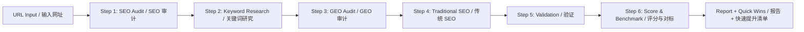

# SEO/GEO Skill / SEO/GEO 优化技能

Comprehensive SEO and GEO (Generative Engine Optimization) for your website. Audit, score, and optimize for both traditional search engines (Google, Bing) and AI search engines (ChatGPT, Perplexity, Gemini, Copilot, Claude).

> 全面的 SEO 与 GEO（生成式引擎优化）技能，帮你审计网站、打分、同时优化传统搜索引擎和 AI 搜索引擎。

---

## 产品介绍 / What It Does

Traditional SEO is the old game — keyword stuffing, meta tags, backlinks. GEO (Generative Engine Optimization) is the new game — getting cited by AI search engines like ChatGPT and Perplexity as a trusted source.

This skill does **both in one pass**:

- 🔍 **SEO audit** — title, meta, OG tags, schema, robots.txt, sitemap, load speed
- 🤖 **GEO audit** — AI bot access, FAQPage schema, Princeton's 9 proven citation-boosting methods
- 📊 **Score & benchmark** — 100-point composite score with industry percentile ranking
- 📝 **Actionable report** — prioritized fixes ranked by impact

> 传统 SEO 是旧玩法。GEO（生成式引擎优化）是新规则——让 AI 搜索引擎引用你。这个技能**一站式搞定两者**：SEO 审计 + GEO 审计 + 行业评分 + 优先级修复清单。

---

## Install with Coding Agent / 安装方式

**Via GitHub (Claude Code, Cursor, etc.):**
> **通过 GitHub 安装（Claude Code、Cursor 等）：**

Place this skill in your agent's skills directory:
> 将此技能放入你的 coding agent 的 skills 目录：

```
~/.claude/skills/seo-geo/
# or
~/.cursor/skills/seo-geo/
```

**Manual install:**
> **手动安装：**

```bash
git clone https://github.com/kaydong/seo-geo-compass.git
cp -r seo-geo-compass ~/.claude/skills/seo-geo-compass/
```

Then register the skill in your agent's configuration.
> 然后在 agent 配置中注册该技能。

---

## 核心功能 / Features

### 1. One-Click Website Audit / 一键网站审计

Run a full technical SEO check — no API keys needed. Covers title, meta, schema, robots, sitemap, and load time.
> 全技术 SEO 检查——无需 API key。覆盖标题、描述、结构化数据、robots、sitemap、加载速度。

```bash
python3 scripts/seo_audit.py "https://example.com"
```

### 2. AI Bot Access Check / AI 爬虫访问检查

Verify that ChatGPT, Perplexity, Claude, and Gemini can crawl your site. Being crawlable = being citable.
> 验证 ChatGPT、Perplexity、Claude、Gemini 能否抓取你的网站。可抓取 = 可被引用。

### 3. GEO Optimization / GEO 优化

Apply **Princeton University's 9 GEO methods** — research-backed techniques that boost AI citation rates by **up to 40%**:
> 应用**普林斯顿大学 9 种 GEO 方法**——经研究验证，可将 AI 引用率提升**最高 40%**：

- Cite Sources / 引用来源 (+40%)
- Statistics Addition / 添加统计数据 (+37%)
- Quotation Addition / 添加引言 (+30%)
- Authoritative Tone / 权威语气 (+25%)
- Easy-to-Understand / 易于理解 (+20%)
- Technical Terms / 专业术语 (+18%)
- Unique Words / 独特词汇 (+15%)
- Fluency Optimization / 流畅度 (+15-30%)

### 4. Schema Markup Generator / Schema 标记生成

Ready-to-use JSON-LD templates for: FAQPage, Organization, Product, SoftwareApplication, WebPage, Article.
> 开箱即用的 JSON-LD 模板：FAQPage、Organization、Product、SoftwareApplication、WebPage、Article。

### 5. Platform-Specific Playbooks / 各平台专项指南

Optimize for each AI engine's unique ranking signals:

| Platform / 平台 | Key Strategy / 核心策略 |
|---|---|
| **ChatGPT** | Branded domain authority + content freshness (≤30 days) / 品牌权威度 + 内容新鲜度 |
| **Perplexity** | FAQ schema + PDF documents + PerplexityBot access / FAQ schema + PDF 文档 + 放行爬虫 |
| **Google AI Overview** | E-E-A-T + structured data + topical authority / 经验-专业-权威-信任 |
| **Copilot / Bing** | Bing indexing + Microsoft ecosystem signals / Bing 索引 + 微软生态信号 |
| **Claude** | Brave Search indexing + high factual density / Brave 索引 + 高事实密度 |

### 6. Composite Scoring / 综合评分 (New / 新功能)

After audit, get a **100-point scorecard** with **industry percentile ranking**. Know exactly where you stand and what to fix first.
> 审计后获得 **100 分制**评分卡 + **行业百分位排名**。清楚知道自己的位置和优先改什么。

Score breakdown across 8 dimensions: Meta Tags, Schema, AI Bot Access, Content Structure, Performance, Mobile, Indexing, GEO.
> 8 个维度分项得分：Meta、Schema、AI 爬虫访问、内容结构、性能、移动端、索引抓取、GEO。

### 7. Keyword Research / 关键词研究

Free mode: use `web_search` for directional keyword insight.
> 免费模式：用 `web_search` 获取方向性关键词洞察。

API mode (optional): connect DataForSEO for precise search volumes and difficulty scores.
> API 模式（可选）：接入 DataForSEO 获取精确搜索量和难度分。

### 8. Shopify SEO Checklist / Shopify SEO 清单

Complete Shopify-specific optimization: collection pages, product pages, blog, technical SEO, app warnings (what to uninstall), and what you can fix yourself vs what needs a developer.
> 完整的 Shopify SEO 清单：合集页、产品页、博客、技术 SEO、App 避坑指南（该卸载哪些）、店主能自己改 vs 需要开发者的对照表。

### 9. Cross-Border & Multilingual SEO / 跨境多语言 SEO

hreflang implementation, URL structure strategy, translation vs localization (don't translate "数据中台" to "data middle platform"), market prioritization framework, translation solution comparison, and anti-patterns for Chinese brands going global.
> hreflang 实现、URL 结构策略、翻译 vs 本地化（别把「数据中台」翻成 "data middle platform"）、市场优先级框架、翻译方案对比、中国出海品牌常见反模式。

### 10. Global Brand GEO Templates / 出海品牌 GEO 模板

Ready-to-copy FAQPage JSON-LD templates for AI SaaS, consumer electronics, home & lifestyle, and fashion brands. Plus: cold-start GEO strategy (for brands with zero customers yet), "China origin" narrative playbook (3 strategies), and a real scored example.
> 可直接复制的 FAQPage JSON-LD 模板（AI SaaS / 消费电子 / 家居生活 / 时尚服装）。附加：冷启动 GEO 策略（零客户也能用）、「中国出身」叙事三策略、真实评分案例。

---

## Menu Setup / 手动操作步骤

### Claude Code / Codex / Other Coding Agents

1. **Clone or download** the skill into your skills directory:
   > 将技能克隆或下载到你的 skills 目录：
   ```bash
   git clone https://github.com/kaydong/seo-geo-compass.git ~/.claude/skills/seo-geo-compass/
   ```

2. **Install Python 3.7+** (required for the audit scripts).
   > 安装 Python 3.7+（运行审计脚本需要）。

3. **No API key needed** for basic audit. For precise keyword data, register at [DataForSEO](https://dataforseo.com/) (free tier = 1,000 calls/month) and add your credentials to `scripts/credential.py`.
   > 基础审计无需 API key。如需精确关键词数据，在 DataForSEO 注册免费账户（每月 1,000 次调用），将凭证填入 `scripts/credential.py`。

4. **Use it** by telling your agent:
   > 使用方式，对 agent 说：
   ```
   "Run SEO audit on https://example.com"
   "Optimize my site for AI search engines"
   "Score my website's SEO/GEO"
   ```

---

## How It Works / 工作原理



**Step 1** scrapes technical SEO signals — meta tags, schema, robots.txt, sitemap, load time — all via curl + Python, no external services.
> 第一步用 curl + Python 抓取技术 SEO 信号——meta、schema、robots、sitemap、加载速度——全程无外部服务依赖。

**Step 2** researches target keywords. Free mode uses your agent's built-in web search. API mode taps DataForSEO for exact search volumes.
> 第二步研究关键词。免费模式使用 agent 内置搜索，API 模式接入 DataForSEO。

**Steps 3-4** apply Princeton GEO methods (backed by peer-reviewed research) and traditional SEO best practices.
> 第三、四步应用普林斯顿 GEO 方法（有同行评议研究支撑）和传统 SEO 最佳实践。

**Step 5** validates schema markup and checks indexing status.
> 第五步验证 schema 标记和索引状态。

**Step 6** (new) calculates a 100-point score across 8 weighted dimensions and maps it to industry peer percentiles — from top 1% to bottom 5%.
> 第六步（新功能）在 8 个加权维度上计算 100 分制评分，并对标行业百分位——从前 1% 到后 5%。

---

## Tech Stack / 技术栈

| Layer / 层 | Technology / 技术 |
|---|---|
| Audit Engine / 审计引擎 | Python 3 (stdlib — `urllib`, `re`, `time`) |
| Schema Templates / Schema 模板 | JSON-LD (Schema.org vocabulary) |
| Keyword Data (API mode) / 关键词数据 | DataForSEO REST API |
| GEO Methodology / GEO 方法论 | Princeton University CS research (2024) |
| Agent Integration / Agent 集成 | Markdown SKILL.md spec |
| Reference Docs / 参考文档 | Markdown |

---

## Built by Kay

Made with ☕ by [Kay](https://github.com/kaydong)

> 由 [Kay](https://github.com/kaydong) 

---

## License

MIT — fork it, ship it, cite us. ⭐ Star if this helps you rank.
